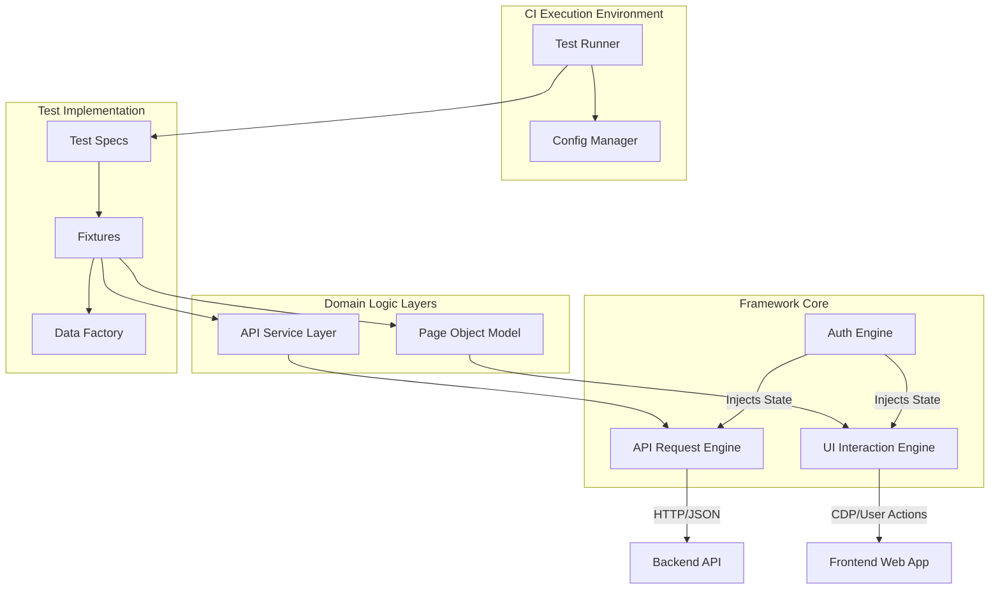
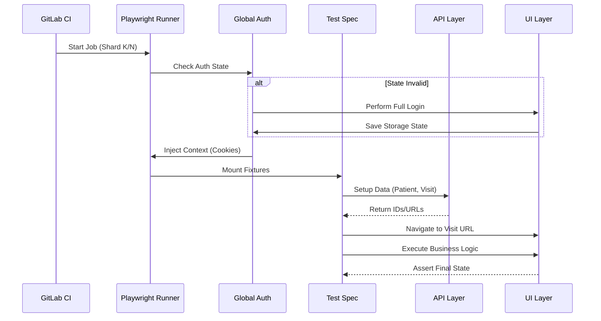

# Project

## Playwright Automation Framework Specification

### Introduction & Vision
#### Project Overview
The objective is to engineer a robust, scalable, and maintainable End\-to\-End \(E2E\) test automation framework for the Dental Office CRM\. This system serves as the primary quality gate within the Continuous Integration \(CI\) pipeline, validating core business functions including Patient Management, Scheduling, and Medical Treatment workflows\. The solution prioritizes execution speed and reliability through a "Hybrid Testing Strategy," utilizing API interactions for data state manipulation and UI interactions strictly for business logic verification\.

#### Architectural Drivers & Success Metrics
The architecture is defined by rigid mathematical constraints regarding performance and reliability\.

**Scalability**: The framework must support a test suite size of `$N$` where `$N \ge 500$` without requiring linear growth in execution time\.

**Execution Performance**: The total pipeline duration `$T_{total}$` must adhere to:

```latex
T_{total} = \frac{\sum_{i=1}^{N} t_i}{S} + C_{setup} \leq 15 \text{ minutes}

```

where `$t_i$` is the duration of individual test `$i$`, `$S$` is the number of parallel shards \(CI Runners\), and `$C_{setup}$` is the constant overhead for container initialization\.

**Reliability Target**: The system enforces a "Zero Flakiness" policy\. The probability of a false negative `$P(F_{neg})$` \(test failing due to infrastructure/timing\) must satisfy:

```latex
P(F_{neg}) < 0.001

```

**Maintainability**: The system must adhere to strict Separation of Concerns\. UI DOM changes must strictly affect the Page Object Layer, leaving API Services and Test Specifications untouched\.

### System Architecture
#### High\-Level Architecture
The solution follows a Layered Service\-Oriented Test Architecture, decoupling the Test Logic from the System Under Test \(SUT\) implementation details\.



#### Sequence of Execution
The lifecycle of a test run involves distinct phases for Initialization, Sharding, Setup, and Execution\.



### Subsystem: Infrastructure & Configuration
#### Component: Configuration Manager
The Configuration Manager acts as the singleton source of truth for all runtime variables, abstracting environment differences \(Dev vs\. Staging\) from the test logic\.

##### Data Models
**AppConfigSchema**: The configuration object is strictly typed and validated using Zod\.

```typescript
interface AppConfig {
  env: 'dev' | 'staging';
  baseUrl: string;
  apiUrl: string;
  credentials: {
    admin: { user: string; pass: string };
  };
  features: {
    captchaEnabled: boolean;
    smsAutoFill: boolean;
  };
  timeouts: {
    action: number;
    navigation: number;
  };
}

```

##### Functional Requirements
The component must read the `TEST_ENV` environment variable to determine which configuration strategy to load\.

The component must merge specific environment configs on top of a base configuration object\.

**Runtime Validation**: Upon initialization, the merged configuration object must be validated against the Zod Schema\. If validation fails, the process must exit immediately with code 1\.

**Secret Masking**: Any log output generated by this component must automatically redact values associated with keys containing "pass", "token", or "secret"\.

##### Verification Plan
**Unit Test**: Initialize the ConfigLoader with an empty `process.env`\. Assert that it throws a Zod Error regarding missing `baseUrl`\.

**Debug Tool**: Implement `npm run debug:config` to print the resolved, redacted configuration to `stdout`\.

#### Component: Observability Engine \(Logger\)
The Logger ensures comprehensive traceability of test execution, supporting both human debugging and automated artifact analysis\.

##### Functional Requirements
###### Section
**Multi\-transport Support**:

If `process.env.CI` is true, logs must be output in **JSON Lines** format for machine parsing\.

If running locally, logs must be output in **Colorized Text** format for readability\.

**Context Injection**: The Logger must automatically append the current Test Name and Step Name to every log entry\.

**Allure Integration**: The Logger must attach high\-severity logs \(`ERROR`, `WARN`\) as text attachments to the Allure Report\.

##### Performance Constraints
Log ingestion overhead must be negligible\. The logging operation time `$t_{log}$` must satisfy:

```latex
t_{log} < 5 \text{ ms}

```

### Subsystem: Framework Core
#### Component: Authentication Engine \(Global Setup\)
This component implements the "Login Once" pattern to minimize test execution time\.

##### Functional Requirements
**Execution Timing**: This component must execute strictly *before* any test projects are started\.

###### Section
**State Management**:

It must perform a full UI login flow\.

It must handle the CAPTCHA step conditionally based on `config.features.captchaEnabled`\.

It must serialize the Browser Context \(Cookies, LocalStorage\) to `playwright/.auth/admin.json`\.

**Validation**: Before saving the state, the component must verify the existence of the session cookie \(e\.g\., `JSESSIONID` or `connect.sid`\)\.

**TODO**: Define the exact selector for the "Login Success" indicator \(Dashboard Element\)\.

##### Verification Plan:
Implement a standalone script `scripts/verify-auth.ts`\.

###### Section
Logic:

Check if `admin.json` exists\.

Parse JSON and extract the authentication token/cookie\.

Decode the JWT \(if applicable\) or check the `expires` timestamp\.

If `$T_{expiry} - T_{now} < 10 \text{ mins}$`, return failure to force a fresh login\.

#### Component: API Request Engine
A wrapper around Playwright's `APIRequestContext` that ensures reliability and consistent error handling\.

##### Functional Requirements
**Initialization**: Must accept the path to `auth.json` and initialize the context with these credentials\.

**Header Injection**: Must automatically set `Content-Type: application/json` on all write requests\.

###### Section
**Error Handling Protocol**:

Intercept every response\.

If `$Status \in [400, 499]$`: Throw `ClientError` with Request URL and Response Body\.

If `$Status \in [500, 599]$`: Throw `ServerError`\.

###### Section
**Retry Logic \(Exponential Backoff\)**:

For status codes `502` \(Bad Gateway\), `503` \(Service Unavailable\), and `504` \(Gateway Timeout\), the engine must retry the request\.

Backoff Formula:

```latex
WaitTime_k = 100 \text{ms} \times 2^k

```

where `$k$` is the retry attempt \(0 to 2\)\.

### Subsystem: Domain Logic \- Data Layer \(Backend Client\)
This subsystem is responsible for the "Setup" phase of the Hybrid Testing Strategy\. It requires strict data modeling to ensure the test data is valid before it reaches the backend\.

#### Common Data Models
All models must be defined as **Zod Schemas** to enable runtime contract verification\.

##### Model: PatientDTO
Represents the structure required to create a new patient\.

```typescript
const PatientSchema = z.object({
  id: z.number().optional(),
  user: z.object({
    surname: z.string(),
    name: z.string(),
    patronymic: z.string(),
    birthday: z.string().regex(/\d{4}-\d{2}-\d{2}/),
    snils: z.string(),
    phone: z.string()
  }),
  policyOmsNumber: z.string().length(16),
  passport: z.object({
    number: z.string(),
    series: z.string()
  })
});

```

##### Model: ShiftDTO
Represents a work schedule for a doctor\.

```typescript
const ShiftSchema = z.object({
  employeeBranchId: z.number(),
  dateFrom: z.string().datetime(),
  dateTo: z.string().datetime(),
  companyBranchId: z.number()
});

```

#### Component: Patient Service
##### Functional Requirements
###### Section
**Method ****create\(payload: PatientDTO\)**:

Must validate the payload against `PatientSchema` before sending\.

Must execute `POST /api/v1/patients`\.

Must return the `id` from the server response\.

###### Section
**SNILS Logic**: The system relies on a valid SNILS\. The Service must ensure the provided SNILS matches the checksum algorithm \(Modulo 101\)\.

Formula for Checksum `$C$`:

```latex
S = \sum_{i=1}^{9} d_i \times (10 - i)

```

```latex
C = \begin{cases} S & \text{if } S < 100 \\ 0 & \text{if } S = 100 \\ S \pmod{101} & \text{if } S > 100 \end{cases}

```

##### Verification Plan:
Implement a contract test script\.

Execute `PatientService.create()` with a known valid payload against the Dev environment\.

Assert response status is 201\.

Assert response body matches `PatientSchema`\.

#### Component: Schedule Service
##### Functional Requirements
###### Section
**Method ****createShift\(payload: ShiftDTO\)**:

Must validate that `$dateTo > dateFrom$`\.

Must execute `POST /api/v1/schedule/shift`\.

Must handle the generic `dataJson` field required by the API\.

#### Component: Visit Service
##### Functional Requirements
###### Section
**Method ****create\(visit: VisitDTO\)**:

Must accept `patientId` and `doctorId`\.

Must execute `POST /api/v1/health/visits`\.

Must return the constructed URL for the visit page:

```latex
URL = BaseURL + "/visits/" + VisitID

```

### Subsystem: Domain Logic \- UI Layer \(Frontend Client\)
This layer implements the Page Object Model \(POM\)\. It is strictly responsible for interacting with the DOM and abstracting selectors\.

#### Component: Design System \(Atoms\)
Reusable, low\-level components acting as the "building blocks" of the application\.

##### Atom: InputField
**Responsibility**: Wraps `locator.fill()` and `locator.type()`\.

**Requirement**: The `fill` method must wait for the element to be actionable, clear existing text, and then input the new value\.

**Requirement**: The `type` method \(used for search fields\) must invoke a delay of 50ms between keystrokes to trigger JS event listeners\.

##### Atom: SelectDropdown
**Responsibility**: Abstraction for both HTML `<select>` and custom `div`\-based dropdowns\.

**Requirement**: Must support selection by "Visible Text" content\.

#### Component: Business Widgets \(Organisms\)
Complex UI components encapsulating domain\-specific logic\.

##### Organism: Dental Chart \(Зубная формула\)
A complex interactive component using SVG/Canvas to represent teeth status\.

**Risk**: Testing this via real data is flaky due to complex DOM rendering\.

###### Section
**Verification Strategy**: **Visual Logic Isolation**\.

The test methods for this component MUST NOT rely on API data setup\.

The methods MUST use `page.route` to intercept the backend request for patient dental status\.

The test MUST inject a mock JSON response:

```json
{ "teeth": [ { "id": 18, "status": "caries" } ] }

```

The test MUST assert that the UI reflects this state \(e\.g\., Tooth 18 element has class `.status-caries`\)\.

**TODO**: Map all 32 teeth IDs to their respective SVG path selectors\.

##### Organism: Treatment Plan
A dynamic grid allowing the addition of medical services\.

**Requirement**: Must provide a method `addService(serviceName: string)`\.

**Requirement**: Must provide a method `transferToVisit()` which clicks the "Add to Visit" button and waits for the grid to empty\.

#### Component: Page Objects
##### Page: Visit Details Page
**Path**: `src/pages/crm/visit-details.page.ts`

###### Section
**Composition**:

`dentalChart`: Instance of Dental Chart Organism\.

`treatmentPlan`: Instance of Treatment Plan Organism\.

`diary`: Instance of Medical Diary Organism\.

###### Section
**State Machine**:

The page must track the Visit Status\.

####### Section
Method `changeStatus(to: string)` must:

Expand status dropdown\.

Click the target status option\.

Wait for the status badge to update text to `$to$`\.

### Subsystem: Test Implementation Layer
#### Component: Data Factory \(Builders\)
Responsible for generating deterministic, valid test data\.

##### Functional Requirements
**Library**: Must use `@faker-js/faker` with `faker.seed(123)` for reproducible test runs during debugging\.

**Builder Pattern**: Must expose fluent interfaces \(e\.g\., `PatientBuilder.withName('John').build()`\)\.

###### Section
**Logic**:

`PatientBuilder` must calculate the correct SNILS checksum for every generated number\.

`PatientBuilder` must generate a valid OmsPolicy number \(16 digits\)\.

#### Component: Fixtures \(Dependency Injection\)
The bridge between Test Specifications and the Framework\.

##### Fixture:
This fixture orchestrates the "Full Visit Cycle" setup\.

**Inputs**: `request`, `browser`\.

###### Section
**Process**:

Instantiate Services \(`PatientService`, `ScheduleService`, `VisitService`\)\.

**API**: Create a Shift for the current user \(Doctor\)\.

**API**: Generate Patient Data via Factory \-> Create Patient\.

**API**: Create Visit for Patient \+ Doctor\.

**UI**: Navigate the browser to the Visit URL\.

**UI**: Instantiate `VisitDetailsPage`\.

**Output**: An object `{ visitPage, patientId, visitId }` passed to the test function\.

### Verification & Tooling Strategy
To empower Junior Developers and ensure system stability, the following CLI tools are mandatory\.

#### Tool: Contract Verifier \(\)
**Goal**: Detect backend breaking changes before running the full suite\.

##### Section
**Logic**:

Iterate through all defined Zod Schemas\.

Make minimal GET/POST requests to the Dev environment\.

Validate responses against schemas\.

**Exit Code**: 0 if all contracts valid, 1 if any mismatch\.

#### Tool: Component Workbench \(\)
**Goal**: Isolate complex UI logic debugging\.

##### Section
**Logic**:

Defines a Playwright Project that skips `globalSetup`\.

Mounts components in a blank page context\.

Uses `page.route` to mock all network traffic\.

Allows the developer to verify "Dental Chart" interactions without needing a real patient in the DB\.

#### Tool: Data Setup Debugger \(\)
**Goal**: Debug the API setup phase\.

##### Section
**Logic**:

Executes the `dentalVisit` fixture logic in a standalone Node\.js script\.

Logs the generated JSON payloads and API responses to the terminal\.

Helps identify if a test failure is due to "Data Creation" or "UI Interaction"\.

### Deployment & CI/CD Requirements
#### Docker Infrastructure
**Image**: The project must use `mcr.microsoft.com/playwright:v1.40.0-jammy` or newer\.

**Locale**: The container must have `LANG=ru_RU.UTF-8` to ensure correct date formatting in the CRM\.

#### GitLab CI Sharding Logic
To meet scalability goals, the pipeline uses parallel matrix execution\.

**Formula**: The `shard` parameter passed to Playwright is derived from GitLab CI variables:

```latex
ShardParams = \frac{CI\_NODE\_INDEX}{CI\_NODE\_TOTAL}

```

**Job Configuration**:

```yaml
test_e2e:
  parallel:
    matrix:
      - SHARD_INDEX: [1, 2, 3, 4]
        TOTAL_SHARDS: 4
  script:
    - npx playwright test --shard=$SHARD_INDEX/$TOTAL_SHARDS

```

#### Artifact Management
##### Section
**Retention Policy**:

Passed Tests: Retain minimal logs\.

Failed Tests: Retain Traces \(zip\), Screenshots \(png\), and Video \(webm\) for 7 days\.

Allure Report: Retain for 30 days\.

## Framework Directory Structure

### src
#### config
##### index\.ts
##### dev\.config\.ts
##### staging\.config\.ts
##### types\.ts
##### env\-loader\.ts
#### lib
##### api
###### request\-manager\.ts
###### base\-service\.ts
###### services
####### patient\.service\.ts
####### schedule\.service\.ts
####### visit\.service\.ts
####### index\.ts
###### api\-endpoints\.ts
##### entities
###### index\.ts
###### swagger\-models\.ts
###### patient\.types\.ts
###### schedule\.types\.ts
###### visit\.types\.ts
##### fixtures
###### index\.ts
###### api\.fixture\.ts
###### pages\.fixture\.ts
#### pages
##### base\.page\.ts
##### auth
###### login\.page\.ts
###### auth\.wizard\.ts
###### sms\.page\.ts
###### role\.page\.ts
###### branch\.page\.ts
##### components
###### sidebar\.component\.ts
###### dental\-chart
####### dental\-chart\.widget\.ts
####### tooth\.component\.ts
####### diagnosis\-menu\.component\.ts
###### datepicker\.component\.ts
###### modal\.component\.ts
##### crm
###### dashboard\.page\.ts
###### patient\-card\.page\.ts
###### visit
####### visit\.page\.ts
####### visit\-status\.component\.ts
####### treatment\-plan\.component\.ts
####### medical\-diary\.component\.ts
####### questionnaire\.component\.ts
#### tests
##### setup
###### auth\.setup\.ts
##### e2e
###### full\-visit\-cycle\.spec\.ts
#### utils
##### data\-factory\.ts
##### date\-utils\.ts
##### logger\.ts
##### generators
###### person\.generator\.ts
###### medical\.generator\.ts
### playwright
#### \.auth
### playwright\.config\.ts
### \.gitlab\-ci\.yml
### Dockerfile
### tsconfig\.json
### package\.json
### \.env\.example
### \.eslintrc\.json
### \.prettierrc
### README\.md

## Automation Framework Implementation Plan

### Milestone 1: Proof of Concept & Risk Mitigation
Establish the repository foundation and execute critical 'Spike' scripts to validate the Hybrid Authentication strategy, Dental Chart interaction feasibility, and Data Localization assumptions\. This milestone serves as the 'Go/No\-Go' gate for the technical architecture\.

#### Phase 1: Project Initialization
Initialize the Node\.js project, configure the strict TypeScript environment, and strictly define the directory hierarchy to ensure Separation of Concerns from Day 1\.

##### Initialize NPM & Install Dependencies
Initialize a new Node\.js project using \`npm init \-y\`\. Install Production Dependencies: \`playwright\`, \`dotenv\`, \`@faker\-js/faker\`\. Install Dev Dependencies: \`@playwright/test\`, \`typescript\`, \`ts\-node\`, \`@types/node\`, \`allure\-playwright\`\. Execute \`npx playwright install \-\-with\-deps chromium\` to ensure local browsers are ready\.

##### Configure TypeScript Strict Mode
Create \`tsconfig\.json\`\. Enforce strict type checking\. Set \`compilerOptions\`: \`target: es2020\`, \`module: commonjs\`, \`moduleResolution: node\`, \`strict: true\`, \`baseUrl: "\."\`, \`paths\`: \`\{"@/\*": \["src/\*"\]\}\`\. Exclude \`node\_modules\`\.

##### Create Directory Hierarchy
Create the exact folder structure: \`src/config\`, \`src/lib/api/services\`, \`src/lib/entities\`, \`src/lib/fixtures\`, \`src/pages/auth\`, \`src/pages/components\`, \`src/pages/crm\`, \`src/tests/e2e\`, \`src/utils\`, \`playwright/\.auth\`, and \`spikes\`\. Create a \`\.gitignore\` file excluding \`node\_modules\`, \`test\-results\`, \`playwright\-report\`, \`\.env\`, and \`playwright/\.auth\`\.

##### Create Sanity Test
Create \`src/tests/sanity\.spec\.ts\`\. Write a basic Playwright test: \`test\('sanity', async \(\{ page \}\) => \{ console\.log\('Environment Ready'\); \}\)\`\. Run \`npx playwright test\` to confirm the environment is correctly configured and can launch Chromium\.

##### Review Phase 1 Completion
Ask User to verify: 1\. Is \`node\_modules\` populated? 2\. Does the folder structure match the architecture plan exactly? 3\. Did the sanity test pass without errors? 4\. Is the \`\.gitignore\` correctly hiding secrets?

#### Phase 2: Critical Spikes \(Probes\)
Develop standalone scripts to probe high\-risk areas: Auth Handshake \(Cookies vs Tokens\), Dental Chart DOM Structure, Docker Networking, and Data Format Validation\.

##### Input: Get Environment Credentials
Ask User for the Development Environment URL, Admin Username, and Admin Password\. Instruct User to create a \`\.env\` file in the root with \`BASE\_URL\`, \`ADMIN\_USER\`, \`ADMIN\_PASS\`\.

##### Spike: Hybrid Auth Handshake
Create \`spikes/probe\-auth\-handshake\.ts\`\. Logic: 1\. Login via UI using \`page\`\. 2\. Save Storage State\. 3\. Create new API Context with that state\. 4\. Attempt \`GET /api/v1/users/me\` \(or similar profile endpoint\)\. 5\. Console log status code\. 200 OK means success; 401 means Hybrid strategy failure\.

##### Spike: Dental Chart DOM
Create \`spikes/probe\-dental\-chart\-dom\.ts\`\. Logic: 1\. Login \(reuse auth\)\. 2\. Navigate to a Patient Chart\. 3\. Locate the Chart Element\. 4\. Log \`element\.innerHTML\` and tag name \(\`svg\` vs \`canvas\`\)\. 5\. Try to click a tooth using a CSS Selector vs X/Y coordinate\. Goal: Determine the most stable locator strategy\.

##### Spike: Data Format Validation
Create \`spikes/probe\-data\-formats\.ts\`\. Logic: 1\. Use \`faker\.ru\` to generate a SNILS and Phone Number\. 2\. Attempt to POST to \`/api/v1/patients\` \(reusing auth\)\. 3\. Log if API returns 201 \(Created\) or 400 \(Validation Error\)\. If 400, we need custom generators\.

##### Spike: Docker Connectivity
Create \`spikes/probe\-docker\.sh\` and \`Dockerfile\.probe\`\. Logic: Build a minimal container, run \`curl $BASE\_URL\` inside it\. Verify the container can resolve and reach the Test Environment URL \(validating network mode\)\.

##### Review Spike Results
Present Spike results to User\. 1\. Auth: Did we get 200 OK? \(If no, abort and redesign Auth\)\. 2\. Chart: Is it SVG \(Selectors\) or Canvas \(Coords\)? 3\. Data: Did Faker default formats pass? 4\. Docker: Did Curl succeed? Obtain approval to proceed to Core Framework\.

### Milestone 2: Framework Core & Data Layer
Build the 'Engine' of the framework: Configuration, Global Authentication, and the API Service Layer\. This enables data\-driven testing\.

#### Phase 3: Configuration & Auth Infrastructure
Implement environment\-aware configuration and the 'Global Setup' pattern to log in once and share state\.

##### Code: Configuration Interface
Create \`src/config/config\.interface\.ts\`\. Define \`config\` interface with \`baseUrl\`, \`apiBaseUrl\`, \`credentials\` \(user/pass\), \`timeouts\`, and \`features\` \(captchaEnabled: boolean, smsCode: string\)\.

##### Code: Environment Loader
Create \`src/config/environment\.ts\`\. Implement logic to read \`process\.env\.TEST\_ENV\` \(defaults to 'dev'\)\. Return the typed config object populated from \`\.env\` and defaults\. Ensure secrets are strictly read from \`process\.env\`\.

##### Code: Login Page Object
Create \`src/pages/auth/LoginPage\.ts\`\. Class \`LoginPage\`\. Methods: \`navigate\(\)\`, \`login\(user, pass\)\`, \`handleCaptcha\(\)\` \(checks \`config\.features\.captchaEnabled\`\), \`submitSms\(code\)\`, \`selectRole\(\)\`, \`selectCompany\(\)\`\. Use Playwright's \`Page\` fixture\.

##### Code: Global Auth Setup
Create \`src/tests/auth\.setup\.ts\`\. Import \`LoginPage\`\. Logic: Perform full login flow\. Assert Dashboard visibility\. Call \`await page\.context\(\)\.storageState\(\{ path: 'playwright/\.auth/admin\.json' \}\)\`\.

##### Code: Playwright Config Update
Update \`playwright\.config\.ts\`\. Define \`projects\`: 1\. \`setup\` \(matches \`auth\.setup\.ts\`\)\. 2\. \`chromium\` \(depends on \`setup\`, uses \`storageState: 'playwright/\.auth/admin\.json'\`\)\. Set global \`baseUrl\` from Config\.

##### Test: Verify Auth State Generation
Run \`npx playwright test \-\-project=setup\`\. Verify \`playwright/\.auth/admin\.json\` is generated\. Inspect content to ensure valid cookies/tokens are present\.

##### Review Phase 3 Completion
Verify: 1\. \`admin\.json\` exists\. 2\. Config loader works with \`TEST\_ENV=staging\`\. 3\. Login Page object covers all auth steps \(Captcha/SMS\)\.

#### Phase 4: API Layer & Data Services
Implement the API wrappers and Domain Services to handle data creation \(Patients, Shifts, Visits\) completely via API\.

##### Code: API Request Context Wrapper
Create \`src/lib/api/request\-context\.ts\`\. Class \`ApiRequestManager\`\. Wrap \`Playwright\.APIRequestContext\`\. Implement \`post\`, \`get\`, \`patch\`\. Add \`try/catch\` blocks to log failures with response body analysis \(crucial for debugging 400s\)\.

##### Code: Base API Service
Create \`src/lib/api/services/BaseApiService\.ts\`\. Constructor accepts \`ApiRequestManager\`\. Define protected properties like \`apiBaseUrl\`\.

##### Code: Glossary Service \(FK Resolution\)
Create \`src/lib/api/services/GlossaryService\.ts\`\. Methods: \`getSpecializationId\(name\)\`, \`getBranchId\(\)\`, \`getJobPositionId\(\)\`\. These will fetch lists from API and return the first matching ID\.

##### Test: Glossary Service Integration
Create \`src/tests/api/glossary\.spec\.ts\`\. Use \`setup\` project\. Instantiate \`GlossaryService\`\. Verify \`getSpecializationId\` returns a non\-null number\. This ensures our data setup won't fail due to bad IDs\.

##### Code: Data Factory \(Faker\)
Create \`src/utils/data\-factory\.ts\`\. Export functions: \`generatePatientBody\(\)\`, \`generateShiftBody\(doctorId, branchId\)\`\. Use \`faker\.ru\`\. Ensure fields match the Swagger JSON schemas provided\.

##### Code: Patient Service
Create \`src/lib/api/services/PatientService\.ts\`\. Method \`createPatient\(\)\`\. Flow: 1\. Generate body \(Data Factory\)\. 2\. POST /patients\. 3\. Return created Patient object \(ID\)\.

##### Test: Patient Service Integration
Create \`src/tests/api/patient\.spec\.ts\`\. Call \`PatientService\.createPatient\`\. Verify API returns 201 Created and response contains a valid \`id\`\.

##### Code: Schedule Service
Create \`src/lib/api/services/ScheduleService\.ts\`\. Method \`createShift\(date\)\`\. POST /schedule/shift\. Handle date formatting \(ISO strings\) carefully\.

##### Test: Schedule Service Integration
Create \`src/tests/api/schedule\.spec\.ts\`\. Call \`createShift\` for \*tomorrow\*\. Verify 201 Created\. \(Avoid today to prevent conflict if run multiple times\)\.

##### Code: Visit Service
Create \`src/lib/api/services/VisitService\.ts\`\. Method \`createVisit\(patientId, doctorId, shiftTime\)\`\. POST /health/visits\. Link the patient to the doctor\.

##### Review Phase 4 Completion
Verify all API Integration tests passed\. Do we have a reliable way to create Patients, Shifts, and Visits without UI? If yes, the 'Hybrid Strategy' is unlocked\.

### Milestone 3: Target Scenario Implementation
Implement the specific UI logic \(Page Objects\) and assemble the final 'Full Dental Visit' End\-to\-End scenario\.

#### Phase 5: UI Components & Pages
Build the Object Repository \(POM\) for the complex CRM interfaces\.

##### Code: Dental Chart Component
Create \`src/pages/components/DentalChart\.ts\`\. Implement \`selectTooth\(number\)\` and \`markCondition\(type\)\`\. \*Strictly follow the locator strategy defined in the Spike \(SVG/Canvas\)\.\* Helper methods: \`saveChart\(\)\`\.

##### Code: Treatment Plan Component
Create \`src/pages/components/TreatmentPlan\.ts\`\. Methods: \`searchService\(name\)\`, \`addService\(\)\`, \`moveItemsToVisit\(\)\`, \`savePlan\(\)\`\.

##### Code: Visit Details Page
Create \`src/pages/crm/VisitDetailsPage\.ts\`\. Class properties: \`dentalChart: DentalChart\`, \`treatmentPlan: TreatmentPlan\`\. Methods: \`changeStatus\(status\)\`, \`fillQuestionnaire\(\)\`, \`fillDiary\(\)\`, \`completeVisit\(\)\`\. Locator for the Status Dropdown is critical\.

##### Code: Custom Fixtures \(DI\)
Create \`src/lib/fixtures/custom\-fixtures\.ts\`\. Extend \`test\`\. Define fixtures: \`patientService\`, \`scheduleService\`, \`visitService\` \(auto\-initialized with API context\)\. Define \`visitDetailsPage\` \(initialized with Page\)\.

##### Review Phase 5 Completion
Review the Page Objects\. 1\. Are selectors robust \(avoiding implementation details like generated class names\)? 2\. Do components properly encapsulate logic? 3\. Are fixtures correctly exporting the services?

#### Phase 6: E2E Scenario Assembly
Combine API Setup and UI Actions into the final smoke test\.

##### Code: E2E Test Skeleton
Create \`src/tests/e2e/dental\-visit\.spec\.ts\`\. Structure: \`test\.beforeAll\` \(API Setup\), \`test\('Full Cycle'\)\` \(UI Steps\)\. Use the custom fixtures\.

##### Code: E2E Test Logic Implementation
Implement steps in \`dental\-visit\.spec\.ts\`\. 1\. API: Create Shift, Patient, Visit\. 2\. UI: Go to Visit URL\. 3\. UI: Status 'Arrived'\. 4\. UI: Chart '18\-Caries'\. 5\. UI: Treat 'Filling'\. 6\. UI: Status 'Completed'\. 7\. Assertions: Verify final status text\.

##### Test: Debug & Verify Scenario
Run \`npx playwright test dental\-visit\.spec\.ts \-\-headed \-\-debug\`\. Step through execution\. Fix any locator timing issues \(use \`await expect\` assertions\)\. Verify the full flow passes\.

##### Review Phase 6 Completion
Verify the 'Smoke Test'\. Does it pass reliably \(3/3 runs\)? Does it cover the Client's critical path? Are assertions meaningful?

### Milestone 4: CI/CD & Scalability
Containerize the solution and finalize the GitLab CI pipeline for parallel execution\.

#### Phase 7: Infrastructure Finalization
Docker, CI Config, Reporting\.

##### Code: Dockerfile Production
Create \`Dockerfile\`\. Base: \`mcr\.microsoft\.com/playwright:v1\.xx\.x\-jammy\`\. Copy \`package\.json\`, \`package\-lock\.json\`\. \`npm ci\`\. Copy \`src/\` and configs\. Entrypoint: \`npx playwright test\`\.

##### Code: Allure Reporting Config
Update \`playwright\.config\.ts\`\. Set \`reporter\`: \`\[\['list'\], \['allure\-playwright'\]\]\`\. Ensure \`outputFolder\` is \`allure\-results\`\.

##### Code: GitLab CI Sharding
Create \`\.gitlab\-ci\.yml\`\. Define \`test\` job\. Use \`parallel: matrix\` \(e\.g\., \`SHARD\_INDEX\` 1/3, 2/3, 3/3\)\. Script: \`npx playwright test \-\-shard=$CI\_NODE\_INDEX/$CI\_NODE\_TOTAL\`\. Artifacts: \`allure\-results\`\. Add \`report\` job to merge results\.

##### Final Project Review & Handover
Final Verification\. 1\. Push to Git\. 2\. Trigger Pipeline\. 3\. Verify Parallel Execution works\. 4\. Verify Allure Report is generated\. 5\. Confirm Project Goals Met\.